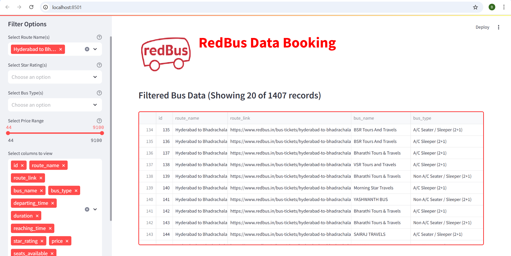

**RedBus Automation Project 🚍**

  

**Overview**

This project automates the process of scraping bus details from RedBus, storing them in a PostgreSQL database, and displaying the data using Streamlit. The main objective is to provide an interactive dashboard for users to explore bus details, such as routes, prices, and bus types.

**Tech Stack**
Python 🐍 – Core scripting language.
Selenium 🌐 – Used for web scraping.
Pandas 📊 – For data manipulation.
PostgreSQL 🗄️ – Database for storing scraped bus details.
Streamlit 🎨 – Web interface for displaying the data.

**Project Workflow**

Web Scraping:

Uses Selenium to scrape bus details from RedBus.
Extracts data such as bus name, type, departure time, price, rating, and availability.
Stores the scraped data in a PostgreSQL database.
Database Storage:

Data is inserted into a PostgreSQL table (bus_routes).
Ensures proper data types (e.g., FLOAT for ratings, TIME for departure times).
Streamlit Dashboard:

Fetches data from PostgreSQL.
Provides filters for routes, price range, bus type, and ratings.
Displays data in a user-friendly interactive table.

Installation & Setup

1️⃣ Install Dependencies

pip install (selenium ,pandas, psycopg2-binary, streamlit)

2️⃣ Set Up PostgreSQL Database
Create a PostgreSQL database named red_bus and a table for bus routes:

CREATE TABLE IF NOT EXISTS bus_routes (
    id SERIAL PRIMARY KEY,
    route_name TEXT,
    route_link TEXT,
    bus_name TEXT DEFAULT NULL,
    bus_type TEXT DEFAULT NULL,
    departing_time TIME DEFAULT NULL,
    duration TEXT DEFAULT NULL,
    reaching_time TIME DEFAULT NULL,
    star_rating FLOAT DEFAULT NULL,
    price DECIMAL DEFAULT NULL,
    seats_available INT DEFAULT NULL
);

3️⃣ Start the Streamlit App
Run the Streamlit dashboard to view the data:

streamlit run (Red_Bus_Web_streamlit.py)

**Usage:**
Open the Streamlit web app and select filters such as:

Bus Route
Bus Type
Price Range
Star Rating

View filtered results in an interactive data table.

Project Structure:

RedBus_Automation_Project

│── scraper.py                  # Selenium script to scrape bus data  
│── database.py                  # Inserts data into PostgreSQL  
│── Red_Bus_Web_streamlit.py      # Streamlit web app  
│── requirements.txt              # List of dependencies  
│── README.md                     # Project documentation  

**The files for this project**

about this project
**README.md**

RedBus scraped & pushed to pgsql
**RedBus_scrape_Push_pgsql_Project.ipynb**

streamlit
**Red_Bus_Web_streamlit.py**

**Streamlit:Libraries Used and the usage:**

streamlit - Create web apps easily.

pandas - Data manipulation and analysis.

psycopg2 - Connect to PostgreSQL databases.

PIL (Image) - Image processing.

requests - HTTP requests.

BytesIO - Handle binary data.

base64 - Encode/decode data.

**Selenium:Libraries Used and the usage:**

selenium - Automate web browser actions.

By - Locate webpage elements.

ActionChains - Simulate complex user interactions.

Keys - Simulate keyboard inputs.

WebDriverWait - Wait for elements to load.

expected_conditions (EC) - Define wait conditions.

Options - Configure browser settings.

exceptions - Handle Selenium errors.

time - Add delays in scripts.

pandas - Manage data in tables.

re - Work with regex patterns.

tempfile - Create temporary files/folders.

**Postgres_SQL:Libraries Used and the usage:**

psycopg2 - Connect to PostgreSQL databases.

ISOLATION_LEVEL_AUTOCOMMIT - Set auto-commit mode.

datetime - Handle dates and times.

**Documentation Links**

🔹 Python: Python Official Docs (https://docs.python.org/3/)  

🔹 Selenium: Selenium Docs (https://www.selenium.dev/documentation/) 

🔹 Pandas: Pandas Docs (https://pandas.pydata.org/docs/)  

🔹 PostgreSQL: PostgreSQL Docs (https://www.postgresql.org/docs/)

🔹 Streamlit: Streamlit Docs (https://docs.streamlit.io/) 

🔹 psycopg2 (PostgreSQL Connector): psycopg2 Docs (https://www.psycopg.org/docs/)  

